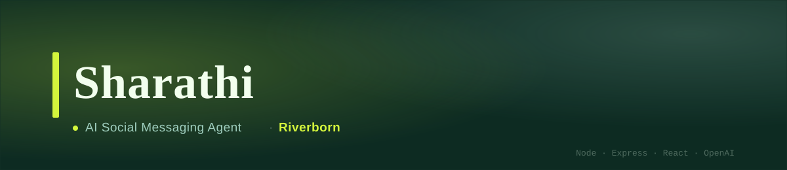
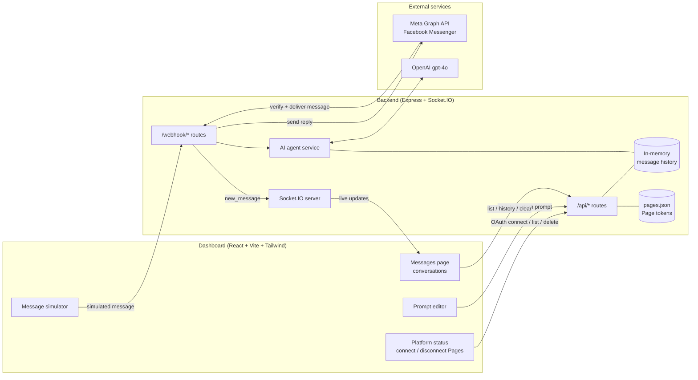
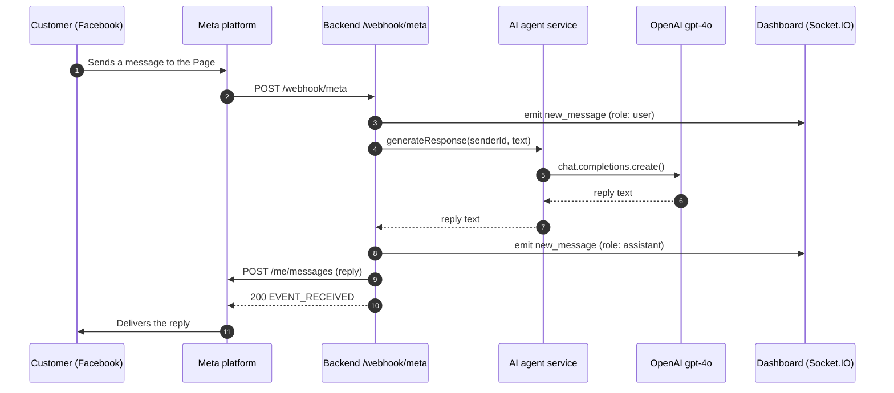

# Sharathi


[](LICENSE)
[](https://riverborn.com)



**Sharathi is a small full-stack AI agent that replies to Facebook Messenger
messages on your business Pages with OpenAI `gpt-4o`, plus a live dashboard to
watch conversations, connect Pages and edit the agent's prompt.**

A customer messages a connected Facebook Page. Meta calls the backend webhook,
the message goes to the AI agent together with the last 10 messages of that
conversation, the reply is sent back to the customer through the Messenger Send
API, and both messages stream to the dashboard over Socket.IO. The project is an
npm workspaces monorepo: an Express + Socket.IO backend and a React + Vite +
Tailwind frontend that run together as one service in production.

> [!NOTE]
> **Built by [Riverborn Limited](https://riverborn.com)**, an AI solutions
> company from Dhaka, Bangladesh. We build agentic AI, generative AI and
> conversational AI (voice, chat and RAG). If you need help building an AI
> customer support agent or another AI product,
> **[book a call](https://riverborn.com/#book)** or email
> **[hello@riverborn.com](mailto:hello@riverborn.com)**.

## Table of contents

- [Features](#features)
- [How it works](#how-it-works)
  - [Message flow](#message-flow)
  - [API reference](#api-reference)
- [Tech stack](#tech-stack)
- [Quick start](#quick-start)
- [Configuration](#configuration)
  - [Facebook app setup](#facebook-app-setup)
  - [Agent prompt](#agent-prompt)
  - [Deploying to Google Cloud](#deploying-to-google-cloud)
- [Project layout](#project-layout)
- [Limitations and known issues](#limitations-and-known-issues)
- [About Riverborn](#about-riverborn)
- [License](#license)

---

## Features

- **Facebook Messenger integration:** OAuth 2.0 "Connect Page" flow, Meta
  webhook verification, inbound message handling and replies through the Send
  API.
- **Several Pages at once:** connect and disconnect Facebook Pages from the
  dashboard. Page tokens are saved to `backend/data/pages.json`; a static
  `PAGE_ACCESS_TOKEN` works as a single-Page fallback.
- **AI replies with short-term memory:** OpenAI `gpt-4o` answers using a rolling
  window of the last 10 messages per user.
- **Live dashboard:** every user and assistant message is pushed to the browser
  over Socket.IO as it happens.
- **Messages page:** a conversation list with search, a platform filter and the
  full stored history of each conversation; clear one conversation or all of
  them.
- **Prompt editor:** rewrite the agent's system prompt from the dashboard (a
  backend restart is needed to apply it; see
  [Limitations](#limitations-and-known-issues)).
- **Webhook simulator:** send a test message to the agent from the dashboard
  without a real Facebook Page.
- **Google Cloud deploy script:** `deploy_gcp.sh` creates a static IP and a
  small Compute Engine VM with Node.js 20, Nginx and PM2, then redeploys the
  backend on every run.

## How it works



The **frontend** (`frontend/`) is a single-page React app. In development it
runs on the Vite dev server, which proxies `/api`, `/webhook` and `/socket.io`
to the backend. In production the backend serves the built files from
`frontend/dist`. It has two pages: the **Dashboard** (Page connection status,
the webhook simulator and the prompt editor) and **Messages** (the live
conversation list).

The **backend** (`backend/`) is one Express app. It serves the REST API used by
the dashboard, receives Meta's webhook calls, asks OpenAI for replies, sends
them back to Facebook and emits every message over Socket.IO. State is kept
simple: conversation history lives in an in-memory `Map` (10 messages per user,
cleared on restart), and connected Pages are stored in a JSON file rather than a
database.

### Message flow



### API reference

| Method | Endpoint | Description |
|---|---|---|
| `POST` | `/api/chat` | Send `{ userId, messageText }` straight to the agent and get the reply |
| `GET` | `/api/messages` | List all conversations, most recent first |
| `GET` | `/api/messages/:userId/history` | Stored history for one user |
| `DELETE` | `/api/messages` | Clear all conversation history |
| `DELETE` | `/api/messages/:userId` | Clear one user's history |
| `GET` | `/api/platforms/status` | Connection status, connected Pages and the OAuth redirect URI |
| `GET` | `/api/platforms/facebook/auth` | Start the Facebook OAuth flow |
| `POST` | `/api/platforms/facebook/callback` | Exchange the OAuth code, store Page tokens, subscribe Pages to webhooks |
| `GET` | `/api/platforms/facebook/pages` | List connected Pages (includes their access tokens) |
| `DELETE` | `/api/platforms/facebook/pages/:pageId` | Disconnect a Page |
| `POST` | `/api/settings/prompt` | Overwrite `backend/src/prompts/systemPrompt.js` with `{ newPrompt }` |
| `GET` | `/webhook/meta` | Meta webhook verification handshake |
| `POST` | `/webhook/meta` | Incoming Messenger events from Meta |
| `POST` | `/webhook/incoming` | Generic test endpoint used by the simulator (`{ platform, senderId, messageText }`) |

Socket.IO events sent by the server: `new_message` (`{ platform, senderId,
text, role }`), `clear_all_messages` and `clear_user_message` (`{ userId }`).

## Tech stack

| Layer | Stack |
|---|---|
| Frontend | React 18, Vite 5, Tailwind CSS 3, Socket.IO client |
| Backend | Node.js, Express 5, Socket.IO 4, Axios, dotenv, nodemon (dev) |
| AI | OpenAI Node SDK, model `gpt-4o` (`max_tokens: 200`, `temperature: 0.7`) |
| Messaging | Meta Graph API v19.0 (Facebook Login, webhooks, Send API) |
| Storage | In-memory `Map` (conversations), JSON file (Page tokens) |
| Deployment (optional) | Google Compute Engine, Nginx, PM2 |

## Quick start

### Prerequisites

- Node.js 18 or newer and npm
- An OpenAI API key
- For real Facebook traffic: a Meta app with the Messenger product, and a public
  HTTPS URL for webhooks (for local work, a tunnel such as
  [ngrok](https://ngrok.com); `*.ngrok-free.app` and `*.ngrok-free.dev` hosts
  are already allowed in `frontend/vite.config.js`)

You can try the agent without Facebook: with only `OPENAI_API_KEY` set (and no
`PAGE_ACCESS_TOKEN` or connected Page), the webhook simulator and `/api/chat`
work, and outgoing Facebook messages are logged instead of sent.

### Install

```bash
git clone https://github.com/riverbornai/sharathi.git
cd sharathi
npm install
```

The root `package.json` declares `backend` and `frontend` as npm workspaces, so
one `npm install` covers both.

### Environment variables

Copy `backend/.env.example` to `backend/.env` and fill it in.

| Variable | Required | Description |
|---|---|---|
| `PORT` | No (default `3000`) | Backend port. Set `3001` for `npm run dev` (see below) |
| `OPENAI_API_KEY` | Yes | Used by `backend/src/services/aiAgent.js` to call `gpt-4o` |
| `META_APP_ID` | For "Connect Page" | Meta app ID for the OAuth flow |
| `META_APP_SECRET` | For "Connect Page" | Meta app secret |
| `META_VERIFY_TOKEN` | For Meta webhooks | Any string; must match the verify token set in the Meta app's webhook settings |
| `META_REDIRECT_URI` | No | Overrides the OAuth redirect URI (default `<protocol>://<host>/facebook-callback`) |
| `PAGE_ACCESS_TOKEN` | No | Static Page token, used when the target Page has not been connected through OAuth |

### Run in development

```bash
npm run dev
```

This starts the backend (`nodemon`) and the frontend (Vite on
`http://localhost:5173`) together. The Vite proxy sends API, webhook and
Socket.IO traffic to **port 3001**, while the backend defaults to **3000**, so
set `PORT=3001` in `backend/.env` (or change the proxy target in
`frontend/vite.config.js`).

### Build and run for production

```bash
npm run build   # builds the frontend into frontend/dist
npm start       # backend serves the API, webhooks and the built dashboard
```

Open `http://localhost:3000` (or your `PORT`).

## Configuration

### Facebook app setup

1. In your Meta app, add the Messenger product and Facebook Login.
2. Add the redirect URI shown in the dashboard's Platform Status panel
   (by default `https://<your-host>/facebook-callback`) as a valid OAuth
   redirect URI. Facebook requires HTTPS for anything other than localhost.
3. Set the webhook callback URL to `https://<your-host>/webhook/meta` and the
   verify token to your `META_VERIFY_TOKEN`.
4. Click **Connect Page** in the dashboard. The backend requests
   `pages_show_list`, `pages_messaging`, `pages_manage_metadata` and
   `pages_read_engagement`, stores a token for every Page you manage and
   subscribes each Page to `messages` and `messaging_postbacks`.

### Agent prompt

The system prompt lives in `backend/src/prompts/systemPrompt.js`. The default is
a generic, short-reply customer support prompt. Edit the file directly or use
the dashboard's prompt editor, which overwrites the file. The file is loaded
once at startup, so restart the backend after changing it. Model and generation
settings are in `backend/src/services/aiAgent.js`.

### Deploying to Google Cloud

`deploy_gcp.sh` is an optional helper for a single Compute Engine VM. On the
first run it reserves a static IP, creates a Debian 11 VM, installs Node.js 20,
Nginx (port 80 proxied to the app on port 3000) and PM2, and opens HTTP/HTTPS in
the firewall. On every run it archives the project, copies it to the VM,
installs backend dependencies and restarts the app under PM2.

```bash
gcloud auth login
gcloud config set project YOUR_PROJECT_ID
./deploy_gcp.sh
```

Settings can be overridden with environment variables:

| Variable | Default |
|---|---|
| `GCP_PROJECT_ID` | the active `gcloud` project |
| `GCP_REGION` | `asia-south1` |
| `GCP_ZONE` | `<region>-a` |
| `GCP_MACHINE_TYPE` | `e2-micro` |
| `GCP_INSTANCE_NAME` | `sharathi` (also the PM2 process name) |
| `GCP_IP_NAME` | `<instance name>-ip` |
| `APP_DIR` | `sharathi` (folder in the VM user's home) |

Read the deployment caveats under
[Limitations](#limitations-and-known-issues) before using it.

## Project layout

```
backend/                     Express + Socket.IO server
  .env.example               environment variable template
  src/index.js               entry point; serves frontend/dist in production
  src/prompts/systemPrompt.js  the agent's system prompt
  src/routes/                REST and webhook routes (chat, messages, platforms, settings, webhooks)
  src/services/aiAgent.js    OpenAI call with per-user history
  src/services/messageStore.js  in-memory conversation history (10 messages per user)
  src/services/pageStore.js  JSON file store for connected Pages (backend/data/pages.json, created at runtime)
  src/services/platforms/facebook.js  Messenger Send API
frontend/                    React + Vite + Tailwind dashboard
  src/App.jsx                app shell, routing and the Facebook OAuth callback page
  src/components/            Dashboard, Messages page, platform status, simulator, prompt editor
docs/banner.svg              README banner
deploy_gcp.sh                optional Google Compute Engine deploy script
package.json                 npm workspaces root (dev, build and start scripts)
```

## Limitations and known issues

This is a small, early-stage project. Please read these before running it
anywhere public.

- **No authentication on the dashboard or API.** Anyone who can reach the
  server can read conversations, change the prompt, disconnect Pages and call
  `GET /api/platforms/facebook/pages`, which returns Page access tokens. Put it
  behind your own authentication or a private network.
- **Webhook requests are not signature-checked.** `POST /webhook/meta` does not
  verify Meta's `X-Hub-Signature-256` header, and `/webhook/incoming` accepts any
  caller.
- **Page tokens are stored in plain text** in `backend/data/pages.json`. Keep
  that file private (it is in `.gitignore`).
- **Prompt edits need a restart**, because `systemPrompt.js` is loaded once at
  startup. The prompt endpoint also writes user input directly into a
  JavaScript file, which is another reason to keep the dashboard private.
- **History is in memory only** and is lost on restart; there is no database.
- **Only Facebook Messenger is implemented.** Text messages are handled;
  attachments and postbacks are ignored.
- **Dev port mismatch:** the backend defaults to port 3000 but the Vite proxy
  targets 3001 (see [Run in development](#run-in-development)).
- **Logging is verbose:** request bodies, message text and the first characters
  of Page tokens are written to the console.
- **`deploy_gcp.sh` caveats:** it leaves out the whole `frontend/` folder, so
  the dashboard is not deployed unless you change the script; it copies your
  local `backend/.env` and `backend/data/` to the VM if they exist (the latter
  overwrites Pages connected on the server); it serves plain HTTP on port 80
  with no TLS; and it uses the Debian 11 image family.
- **`package-lock.json` is slightly out of date:** it does not include
  `nodemon`, so `npm install` will update it and `npm ci` may fail until it is
  regenerated.
- There are no automated tests.

## About Riverborn

Sharathi was built by **[Riverborn Limited](https://riverborn.com)**, an AI
solutions company based in Dhaka, Bangladesh that builds AI systems for clients
worldwide. We built it as a simple, self-hosted starting point for AI agents
that answer customers on social messaging channels.

What we build:

- 🤖 **Agentic AI:** autonomous AI agents and multi-agent systems that
  automate real business workflows
- ✨ **Generative AI:** AI products and MVPs built on large language
  models, taken from prototype to production
- 💬 **Conversational AI:** voice AI agents, chatbots, and RAG systems that
  answer from your own documents and data

Need help with AI? We'd like to hear from you.

- 🌐 Website: [riverborn.com](https://riverborn.com)
- 📅 Book a discovery call: [riverborn.com/#book](https://riverborn.com/#book)
- ✉️ Email: [hello@riverborn.com](mailto:hello@riverborn.com)
- 💼 [LinkedIn](https://www.linkedin.com/company/74964253) · [X](https://x.com/riverbornai) · [Facebook](https://facebook.com/riverbornai) · [GitHub](https://github.com/riverbornai)

## License

Sharathi is released under the
[PolyForm Internal Use License 1.0.0](LICENSE).

- You are free to use, run and modify it for your own or your company's
  internal purposes.
- You may not sell it, redistribute it, or offer it to others as a product or
  hosted service.
- For a commercial license, email
  [hello@riverborn.com](mailto:hello@riverborn.com).

See [LICENSE](LICENSE) for the full terms.
